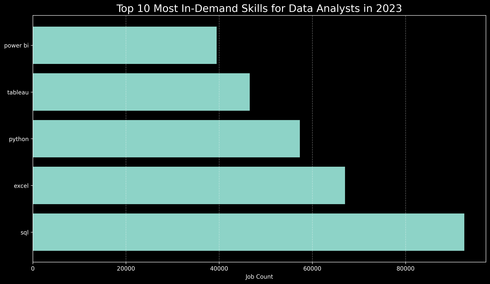
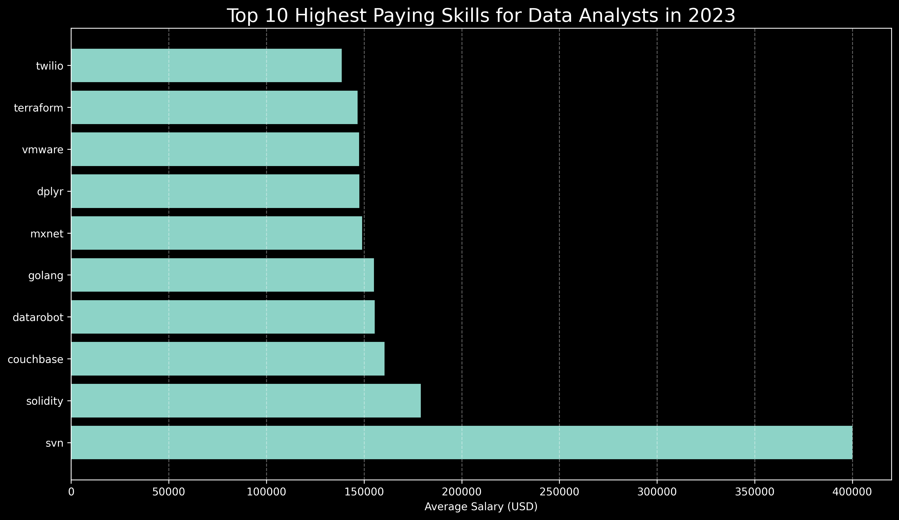
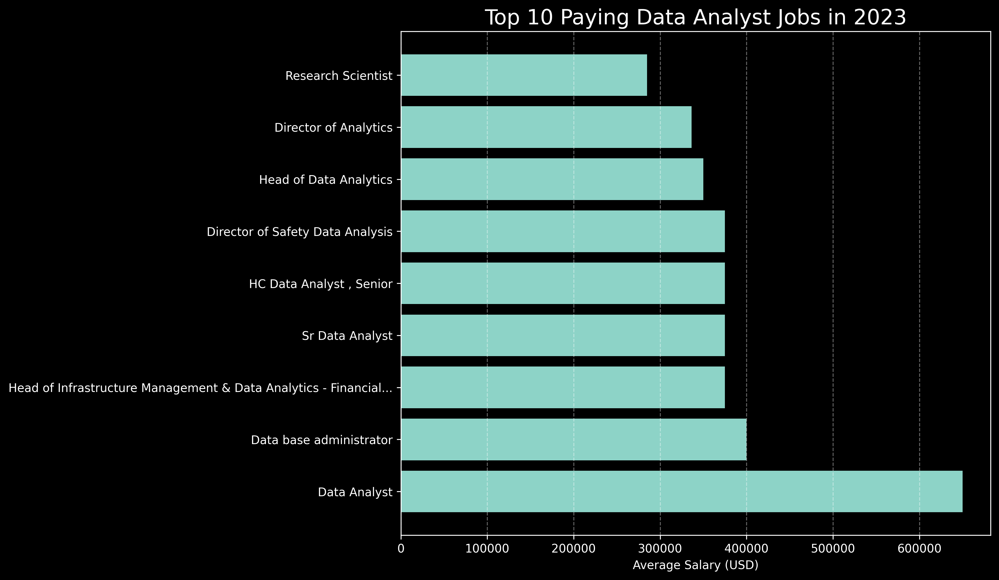
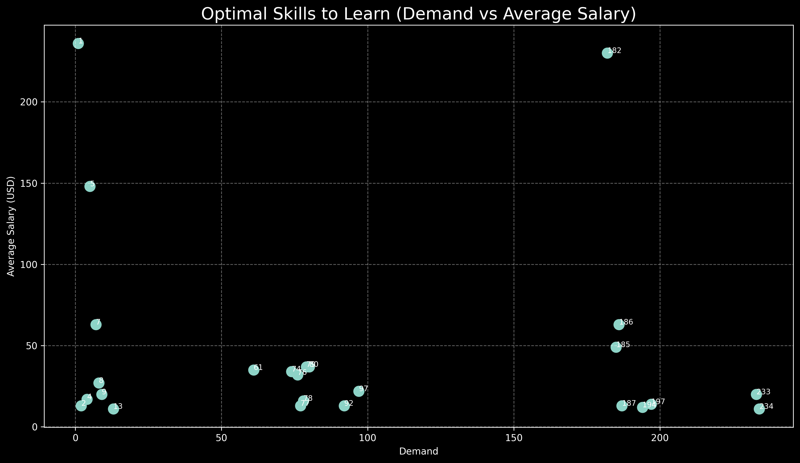

# 📊 SQL Data Analyst Job Trends Analysis 
 
<div align="center">


### Exploring Data Analyst Salaries, Skill Demand, and Career Opportunities Using PostgreSQL

Analyzing real-world job posting data to uncover salary trends, in-demand skills, and the most valuable technologies for aspiring Data Analysts.

</div>

---

# 📖 Table of Contents

* [Project Overview](#-project-overview)
* [Background](#-background)
* [Dataset](#-dataset)
* [Tools Used](#️-tools-used)
* [Project Structure](#-project-structure)
* [Analysis Questions](#-analysis-questions)
* [The Analysis](#-the-analysis)
* [Key Insights](#-key-insights)
* [Visualizations](#-visualizations)
* [What I Learned](#-what-i-learned)
* [Future Improvements](#-future-improvements)
* [Author](#-author)

---

# 📌 Project Overview

This project explores the Data Analyst job market using SQL and PostgreSQL.

The goal was to identify:

* 💰 The highest-paying Data Analyst jobs
* 🛠 Skills required for top-paying positions
* 📈 Most in-demand skills in the market
* 💵 Skills associated with the highest salaries
* 🎯 The most optimal skills to learn based on salary and demand

Using SQL queries and real-world job posting data, this analysis transforms raw data into actionable career insights for aspiring Data Analysts.

---

# 🌍 Background

The Data Analytics field is rapidly growing as organizations increasingly rely on data-driven decision making.

As an aspiring Data Analyst, I wanted to answer important career-focused questions such as:

* Which skills are employers actively looking for?
* What technologies provide the highest earning potential?
* Which skills offer the best balance between demand and salary?
* What learning roadmap should an aspiring analyst follow?

This project leverages PostgreSQL and SQL analytics to uncover these insights.

---

# 📂 Dataset

The analysis uses four relational datasets:

### company_dim.csv

Contains company information associated with job postings.

### job_postings_fact.csv

Contains job-related information including:

* Job Title
* Salary Information
* Location
* Work Schedule
* Remote Availability
* Posting Date

### skills_dim.csv

Contains skill definitions and identifiers.

### skills_job_dim.csv

Bridge table connecting jobs and required skills.

---

# 🛠️ Tools Used

| Tool         | Purpose             |
| ------------ | ------------------- |
| PostgreSQL   | Database Management |
| SQL          | Data Analysis       |
| pgAdmin      | Query Execution     |
| VS Code      | Query Development   |
| Git & GitHub | Version Control     |
| CSV Files    | Data Storage        |

---

# 📁 Project Structure

```text
sql-data-analyst-job-trends-analysis
│
├── csv_files
│   ├── company_dim.csv
│   ├── job_postings_fact.csv
│   ├── skills_dim.csv
│   └── skills_job_dim.csv
│
├── project_sql
│   ├── top_paying_jobs.sql
│   ├── top_paying_job_skills.sql
│   ├── top_demanded_skills.sql
│   ├── top_paying_skills.sql
│   └── optimal_skills.sql
│
└── README.md
```

---

# ❓ Analysis Questions

### 1. What are the top-paying Data Analyst jobs?

### 2. What skills are required for top-paying Data Analyst jobs?

### 3. What are the most in-demand skills for Data Analyst jobs?

### 4. What are the highest-paying skills?

### 5. What are the most optimal skills to learn?

---

# 📊 The Analysis

## 1️⃣ Top Paying Data Analyst Jobs

This query identifies the highest-paying Data Analyst positions based on annual salary.

### Key Findings

* The highest-paying Data Analyst role offered **$650,000 annually**.
* Companies such as **Mantys**, **Citigroup**, **AT&T**, and **Illuminate Mission Solutions** offered some of the highest salaries.
* Senior-level and specialized analytical positions dominated the top salary rankings.
* Remote opportunities were present among top-paying positions.

---

## 2️⃣ Skills Required for Top Paying Data Analyst Jobs

This analysis identifies the skills most frequently associated with high-paying Data Analyst roles.

### Most Common Skills

* SQL
* Python
* R
* Azure
* Databricks
* Tableau
* Power BI
* Snowflake
* Pandas
* Excel

### Insight

High-paying Data Analyst jobs typically require a combination of:

* Database querying
* Programming
* Cloud technologies
* Business intelligence tools

Employers increasingly value analysts who can work across the entire data lifecycle.

---

## 3️⃣ Most In-Demand Skills

This query measures how often skills appear across Data Analyst job postings.

### Top Skills by Demand

| Skill    | Job Count |
| -------- | --------: |
| SQL      |    92,628 |
| Excel    |    67,031 |
| Python   |    57,326 |
| Tableau  |    46,554 |
| Power BI |    39,468 |

### Insight

SQL remains the most requested skill in the Data Analyst market.

The combination of SQL, Excel, and Python forms the foundation of most Data Analyst job requirements.

---

## 4️⃣ Highest Paying Skills

This analysis ranks skills based on average salary.

### Top Paying Skills

| Skill     | Average Salary |
| --------- | -------------: |
| SVN       |       $400,000 |
| Solidity  |       $179,000 |
| Couchbase |       $160,515 |
| DataRobot |       $155,486 |
| Golang    |       $155,000 |

### Insight

Specialized and niche technologies command significantly higher salaries than traditional reporting tools.

Although demand is lower, expertise in these technologies can lead to premium compensation.

---

## 5️⃣ Most Optimal Skills to Learn

This query combines salary and demand to identify skills with the strongest career value.

### Top Optimal Skills

| Skill     | Demand Count | Average Salary |
| --------- | -----------: | -------------: |
| Python    |          236 |       $101,397 |
| Tableau   |          230 |        $99,288 |
| Snowflake |           37 |       $112,948 |
| Azure     |           34 |       $111,225 |
| AWS       |           32 |       $108,317 |
| Oracle    |           37 |       $104,534 |
| Hadoop    |           22 |       $113,193 |

### Insight

The best return on investment comes from mastering:

1. SQL
2. Python
3. Tableau
4. AWS / Azure
5. Snowflake

These technologies offer a strong balance between market demand and earning potential.

---

# 📈 Visualizations

## Most In-Demand Skills



---

## Highest Paying Skills



---

## Top Paying Data Analyst Jobs



---

## Optimal Skills (Demand vs Salary)



---

# 🔑 Key Insights

### SQL Dominates the Market

SQL remains the most essential skill for Data Analysts and appears more frequently than any other technology.

### Python Increases Career Opportunities

Python consistently appears in both high-demand and high-paying job postings.

### Visualization Skills Matter

Tableau and Power BI remain among the most requested tools for reporting and business intelligence.

### Cloud Skills Boost Salaries

AWS, Azure, and Snowflake are increasingly associated with higher-paying positions.

### Balanced Skill Sets Win

Professionals who combine SQL, Python, visualization tools, and cloud technologies are positioned for long-term career growth.

---

# 📚 What I Learned

Throughout this project, I strengthened my understanding of:

* Advanced SQL Queries
* JOIN Operations
* Aggregate Functions
* Common Table Expressions (CTEs)
* Data Cleaning
* Exploratory Data Analysis (EDA)
* Salary Trend Analysis
* PostgreSQL Database Management
* Relational Data Modeling
* Business Insight Generation

This project improved my ability to transform raw job market data into meaningful and actionable insights.

---

# 🚀 Future Improvements

* Develop an interactive Power BI dashboard
* Add geographic salary analysis
* Compare Data Analyst, Data Scientist, and Data Engineer trends
* Build salary prediction models
* Create automated reporting pipelines
* Perform time-series trend analysis

---

# 👨‍💻 Author

### Ajinkya Mariche

**B.Tech Computer Science Engineering (Data Science)**
**Aspiring Data Analyst**

🔗 GitHub: https://github.com/Ajinkya7890

If you found this project useful, consider giving it a ⭐ on GitHub.

---

⭐ Turning data into actionable insights through SQL and analytics.
